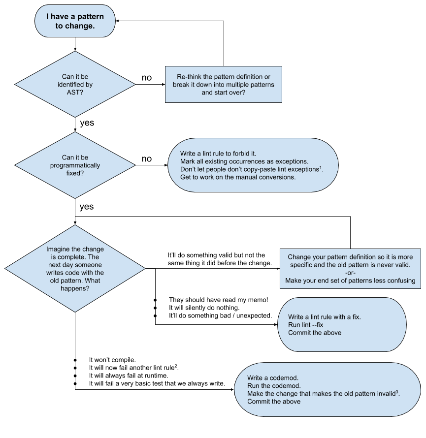

# Codemods and automatic refactoring

## Should I codemod or should I lint rule?



## Guessing how hard it's going to be

Editing small things in line is much easier than manipulating things.

Ex: change an identifier, change a literal, remove a statement, remove a comment.

Structural things are harder since you need to utilize API that is terribly documented, confusing, and you will have to account for many possible different structures.

Ex: return the last statement in a block,

Adding and moving line comments is perplexing. The line comments are stored in a separate structure and ordering them is currently confusing to me.

## JSCodeShift: Getting Started

1. Install jscodeshift (only needed the first time if you don't have it)
   ```shell
   $ npm install -g jscodeshift
   ```
1. Write a transform file
   - use https://astexplorer.net/
     - pick an appropriate language like `babel-eslint`
     - under transform pick `jscodeshift`
     - (if you're working on an `eslint` rule pick `espree` and `eslint`)
     - paste your code to refactor in the top left box
     - write your transform code in the bottom left box
     - preview the output in the bottom right box
   - Take the transform and save it in a file somewhere. I'll call mine `my_transform.js` and I saved it in `~/my_project/script/jscodeshift/`
1. Run your transform on a single file to test. Inspect the result to make sure you like the output
   ```shell
   $ cd ~/my_project
   $ jscodeshift -t script/jscodeshift/my_transform.js frontend/javascripts/components/**/*.jsx
   ```
1. Run your transform on all your target files

   ```shell
   $ jscodeshift -t script/jscodeshift/my_transform.js frontend/javascripts/components/**/*.jsx
   ```

   > **NOTE**: `/**/` is glob notation for "any amount of subdirectories". This won't work by default in Mac terminals. Apple doesn't like GPL3 so they haven't upgraded bash versions since 2007. That old version doesn't support `**` (it treats it as just two `*` wildcards back to back and you'll only match files at exactly one folder depth, no more no less). You can work around this by installing a modern bash, running it in the normal terminal, then running your command.
   >
   > ```shell
   > $ brew install bash
   > ...
   > # [installation happens]
   > ...
   > $ bash
   > bash-5.0$ jscodeshift -t script/jscodeshift/my_transform.js frontend/javascripts/components/**/>*.jsx
   > ```

1. Bask in the glory

Unfortunately... the "Write a transform file" step is really tricky.

## Ingredients:

Your file should `export default` a function that takes two parameters: `(file, api)`. The jscodeshift api is in `api.jscodeshift`. `file.source` contains the source code from the file beint transformed. Calling `j(file.source)` will parse the source into an AST that you can then manipulate. At the end of your transform you need to return the source. Every transform I write starts with this boilerplate outline:

```js
// my_empty_transform.js

export default function transformer(file, api) {
  const j = api.jscodeshift;
  let root = j(file.source);

  // Manipulate the AST

  return root.toSource({ quote: 'single' });
}
```

When working with jscodeshift you're mostly going to interact with these three special types: `Collection`, `Path`, and `Node`. In the above example `root` is a `Collection` containing one `Path` which has a `Node` that represents the root of the file.

A Collection is a collection of zero, one, or many `Path`s. Typically, you will be working with the `root` collection or with a collection you create by calling `.find` on another collection.

A `Node` is the description of a piece of code structure. It contains context on what the particular piece of code is and what structure it may contain.

A `Path` is a wrapper around `Node` that additionally contains information about it's parent and scope

---

## Collection Methods:

Here are a few basic descriptions of essential collection functions lifted from the [Collection docs](https://rawgit.com/facebook/jscodeshift/master/docs/Collection.html).

> #### `find(type, filter)` → {Collection}
>
> Find nodes of a specific type within the nodes of this collection.
>
> #### `findJSXElements(name)` → {Collection}
>
> Finds all JSXElements optionally filtered by name
>
> #### `filter(callback)` → {Collection}
>
> Returns a new collection containing the nodes for which the callback returns true.
>
> #### `forEach(callback)` → {Collection}
>
> Executes callback for each node/path in the collection.
>
> #### `replaceWith(nodes)` → {Collection}
>
> Simply replaces the selected nodes with the provided node. If a function is provided it is executed for every node and the node is replaced with the functions return value.

#### remove()

prunes all paths in collection

---

## Path Methods:

#### replace()

replaces the path with something else

#### prune()

removes the path from the tree

### Node Methods:

`find` - nope this isn't a thing.
